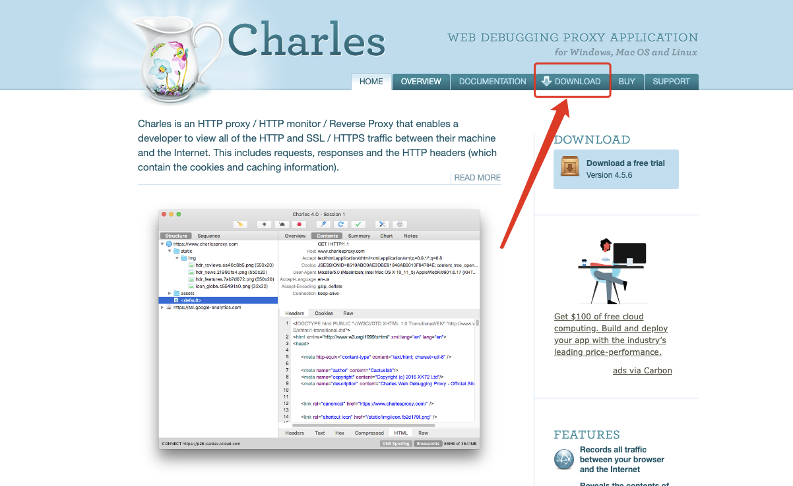
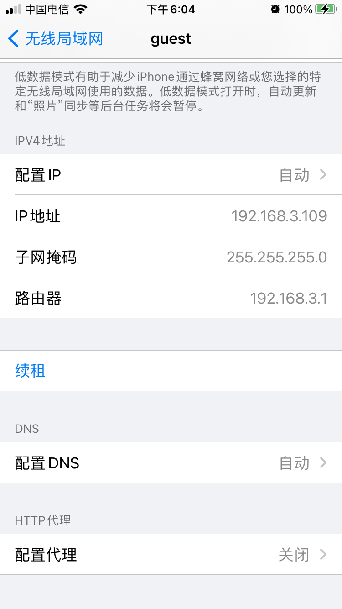
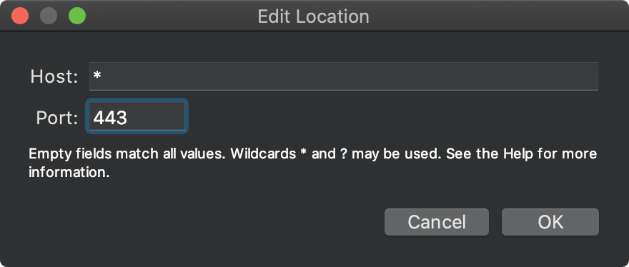

# macOS Charles 4.x版本的安装及使用

## 下载安装

----------

Charles官网下载，下载成功后按照指示安装即可。

官网地址：[www.charlesproxy.com](https://link.jianshu.com/?t=http%3A%2F%2Fwww.charlesproxy.com%2F)

下载成功后，是试用版，试用版有时间限制，需要激活来解锁全部功能，此处感谢年糕妈妈技术团队提供的激活码：

Registered Name: https://zhile.io

License Key: 48891cf209c6d32bf4

（转载自掘金：[macOS Charles 4.x版本的安装及使用（含破解激活）](https://juejin.im/post/6844903733478817800)）

## 激活步骤

---

打开Charles-》help-》Registered Charles，输入账号和key提交即可。

## HTTP代理设置

---

#### 设置PC端代理端口：

打开Charles-》Proxy-》Proxy Settings

此处设置代理端口：8888（也可以手动更改，只要一致即可），以便后续手机端端口的设定。

#### 设置手机端代理端口号：

1、查看IP地址

PS：此处也可以通过option+Wi-Fi查看

2、手机链接与Mac相同的网络，并设置代理（此处只介绍iOS的设置方式，因为没有安卓手机，但是操作基本相同）

      

3、当设置成功后，联网访问Charles会给出如下提醒：

4、点击Allow，此时就可以看到抓取到的数据了：

## HTTPS代理设置

---

###### 1、Proxy-》SSL Proxying Settings

###### 2、Enable SSL Proxying

###### 3、添加SSL相关访问的端口（一般默认是443，但是有些可能会自定义SSL端口）

PS：此处的Host填写*意思是所有地址，如果不想抓取其他的，可以填写指定的Host地址

PS：443为https的一般默认端口号，可根据抓取的访问更改、添加。

###### 4、iOS手机安装证书（安卓手机相同，根据安卓的提示进行即可）

a. 确保手网络已经代理到Charles，打开Safari输入证书下载地址:

http://chls.pro/ssl

b. 点右上角安装，提示输入手机锁屏密码，密码输入完成后安装成功

c. 最后进入设置-》通用-》关于本机-》证书信任设置，选择Charles-》信任-》继续，安装完成。

